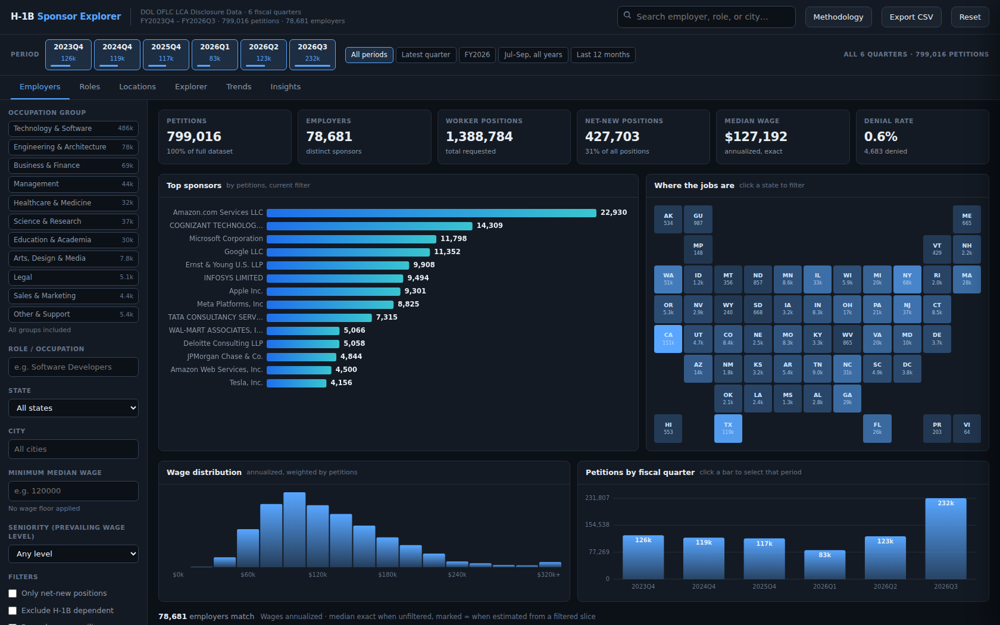
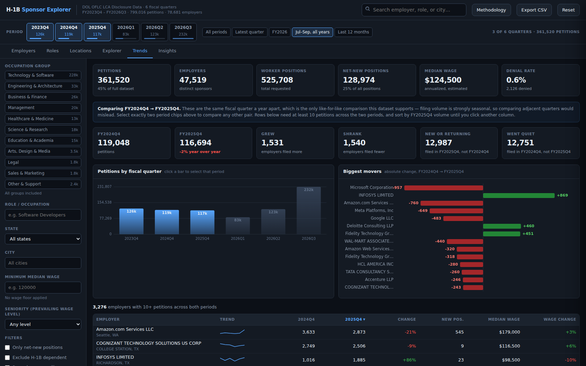
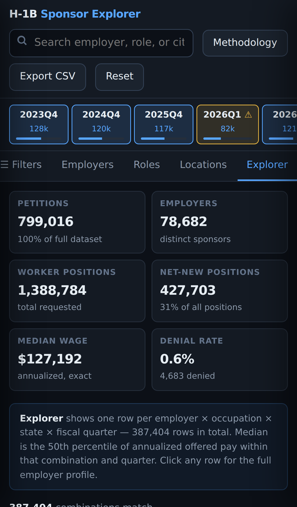

# H-1B Sponsor Explorer

An offline, single-file dashboard over **799,016 H-1B labor condition applications** published by the
U.S. Department of Labor — searchable by employer, occupation, wage, worksite and fiscal quarter.

No backend, no database, no API keys. The whole dataset is compressed into the page and every query
runs in the visitor's browser.



## What it does

| View | What it answers |
|---|---|
| **Employers** | Who sponsors, how much they pay, how senior the roles are, how they compare to the prevailing wage |
| **Roles** | 1,041 occupations with 25th/50th/75th/90th percentile wages and how many employers hire each |
| **Locations** | Tile map of the US, top metros, highest-paying states, where net-new positions are |
| **Explorer** | Every employer × occupation × state × quarter combination, 387,404 rows, sortable on any column |
| **Trends** | Year-over-year comparison — who grew, who shrank, who appeared, who went quiet |
| **Insights** | Volume-thresholded rankings: real headcount growth, pay above prevailing, seniority, DOL LCA denial rates |
| **Lottery** | National USCIS registration history, multiple-registration counts, and FY2027 wage-weighted projections |

Filters (occupation group, role, state, city, wage floor, seniority level, period) apply across every
DOL LCA view at once. The national USCIS Lottery view is deliberately unfiltered because no public
registration-level data or registration-to-LCA join key exists. The URL carries filter state, so any
view is a shareable link. Export CSV dumps whatever is currently on screen.



## Things it does that the commercial H-1B sites don't

**Net-new vs. renewals.** The single most useful column for a job search. Cognizant filed 5,779
LCAs in FY2026 with **13** net-new positions — they are renewing existing staff, not hiring.
A raw LCA count cannot tell those apart.

**Employer name canonicalization.** The raw files spell one company many ways ("1x Technologies Inc.",
"1X Technologies, Inc.", "1x Technologies, Inc"), which fragments its ranking. Case, punctuation and
legal suffixes are normalized, collapsing 90,943 raw strings into 78,682 employers while keeping
genuinely distinct subsidiaries separate.

**Blanket-filing detection.** One LCA can cover many positions. The file median is 1, but a few
employers file dozens at a time — Grandison Management filed 1,988 applications each requesting 40
therapist positions, alone 78% of all worker positions in the Healthcare group. Any employer averaging
10+ positions per filing is flagged, and rankings sort by LCAs rather than positions.

**Honest wage estimates.** Exact percentiles are precomputed and used whenever nothing is filtered;
estimates appear only on filtered slices and are marked `≈`.

**Data caveats surfaced in the UI.** FY2026 Q1 is flagged because the October 2025 federal shutdown
took DOL's FLAG system offline — 1,388 decisions on 1 October, then one to four per day for the rest
of the month. The quarter holds roughly two months of decisions, so it is not comparable to another Q1.

## Lottery data and limits

The Lottery view uses USCIS's national H-1B electronic-registration table for FY2021–FY2026 and the
DHS FY2027 weighted-selection final rule. It reports **selected registrations ÷ eligible
registrations**, not a visa approval rate or an exact person-level probability. From FY2025 onward,
USCIS selects unique beneficiaries but its published historical table still reports selected
registrations.

USCIS does not publish registration-level outcomes, employer-specific selection totals, or a key that
can join a registration to a DOL LCA. The lottery statistics therefore never respond to the LCA
filters and are never presented as employer-specific odds. FY2027 wage-level percentages are DHS
projections from the final rule, not observed outcomes or estimates derived from this dashboard's LCAs.

## Data

U.S. Department of Labor, Office of Foreign Labor Certification —
[LCA Disclosure Data](https://www.dol.gov/agencies/eta/foreign-labor/performance).
Public federal data. This build covers FY2023 Q4, FY2024 Q4, FY2025 Q4 and FY2026 Q1–Q3.

Period coverage is deliberately not continuous: OFLC publishes a cumulative file through Q3 of the
current fiscal year and separate Q4 files for closed years. Periods are selectable chips rather than a
slider so the gaps stay visible.

LCAs are deduplicated on case number at their **earliest** decision. 5,896 cases appear in two
source files — in every instance certified once and withdrawn later, a median of 409 days apart — so
each is counted in the quarter it was certified, not the quarter it was withdrawn. The six quarters
form a clean partition: selecting several adds them with no double counting.

Contains employer and law-firm organization names only. No attorney names, emails, phone numbers or
tax IDs are carried into the build.

## Rebuild from source

```bash
pip install pandas pyarrow python-calamine

# 1. drop LCA_Disclosure_Data_FY*.xlsx into data/ (get them from the DOL link above)
python3 pipeline/ingest.py     # xlsx -> per-file parquet (skips anything already done)
python3 pipeline/build.py      # parquet -> compressed payload
python3 pipeline/fetch_lottery.py # USCIS history + DHS FY2027 projections -> validated JS
python3 pipeline/mkbuilds.py   # payload + src/ -> dist/ and site/
```

`mkbuilds.py` alone regenerates the single-file build from the payload already committed under
`site/`, so you can rebuild the UI without re-downloading 545 MB of spreadsheets.

## Host it

`site/` is a static folder — no build step.

```bash
npx wrangler pages deploy site      # Cloudflare Pages
```

Or serve it yourself, with traffic stats:

```bash
cd site
python3 serve.py                                  # terminal 1
cloudflared tunnel --url http://localhost:8080    # terminal 2
python3 stats.py --html                           # traffic report
```

`serve.py` logs one JSON line per request, reading the real visitor IP from Cloudflare's
`CF-Connecting-IP` header (behind a tunnel the socket only sees 127.0.0.1). IPs are salted-hashed
before they touch disk. The log, salt and report are all refused by the server and written outside
the served folder. See [site/README.md](site/README.md).

For **GitHub Pages**, point Pages at `/site` and delete `serve.py` / `stats.py` first — on a static
host they would just sit there as downloadable text.



## Layout

```
pipeline/   ingest.py -> build.py -> mkbuilds.py
src/        dashboard source, concatenated in order into template.html
site/       built static site (index.html + payload.bin.gz), plus the self-hosting scripts
dist/       single-file build, generated
```

## Notes

The dashboard needs a browser with `DecompressionStream` (Chrome 80+, Firefox 113+, Safari 16.4+).
It loads in ~1.4 s and uses ~210 MB of browser memory on desktop; on a mid-range phone expect ~5 s
and a ~2.4 s full re-render. Once loaded it works with the network off.

Data is public federal information; the analysis and interpretation here are mine.
